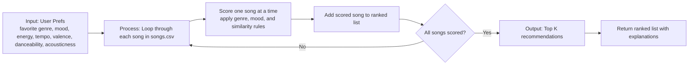
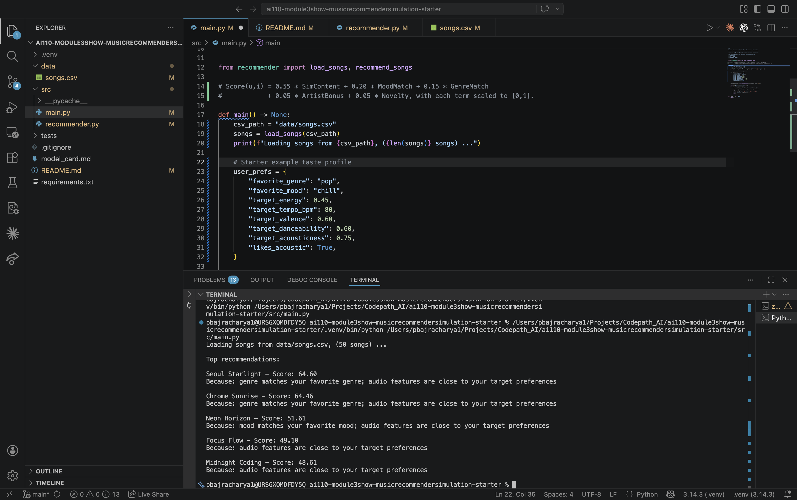
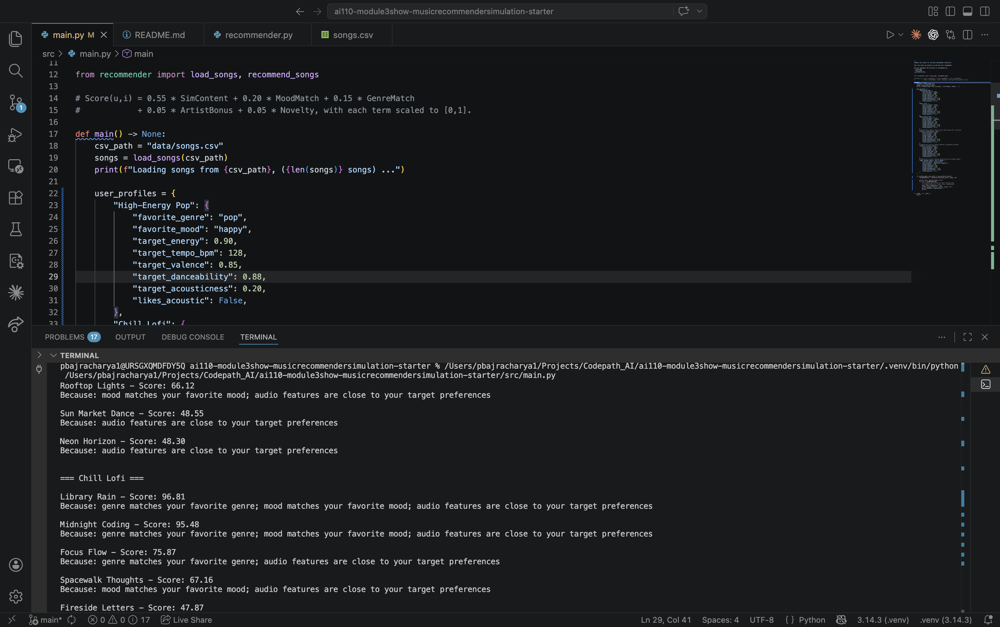
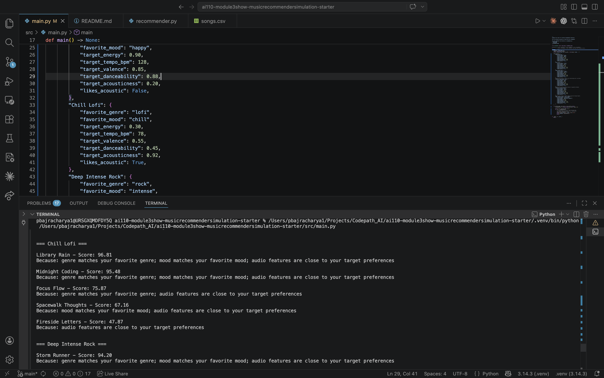
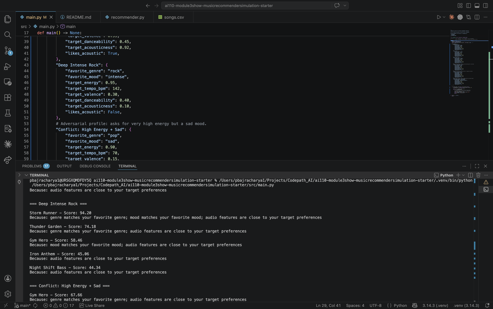
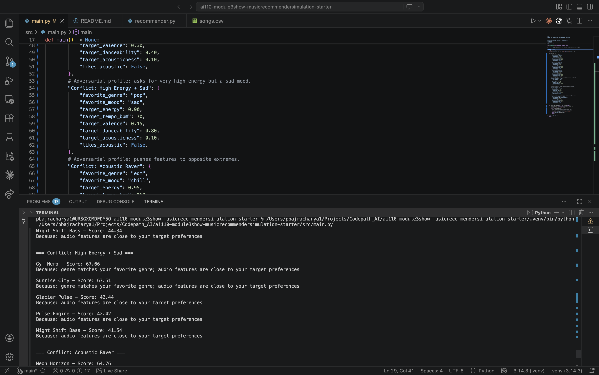
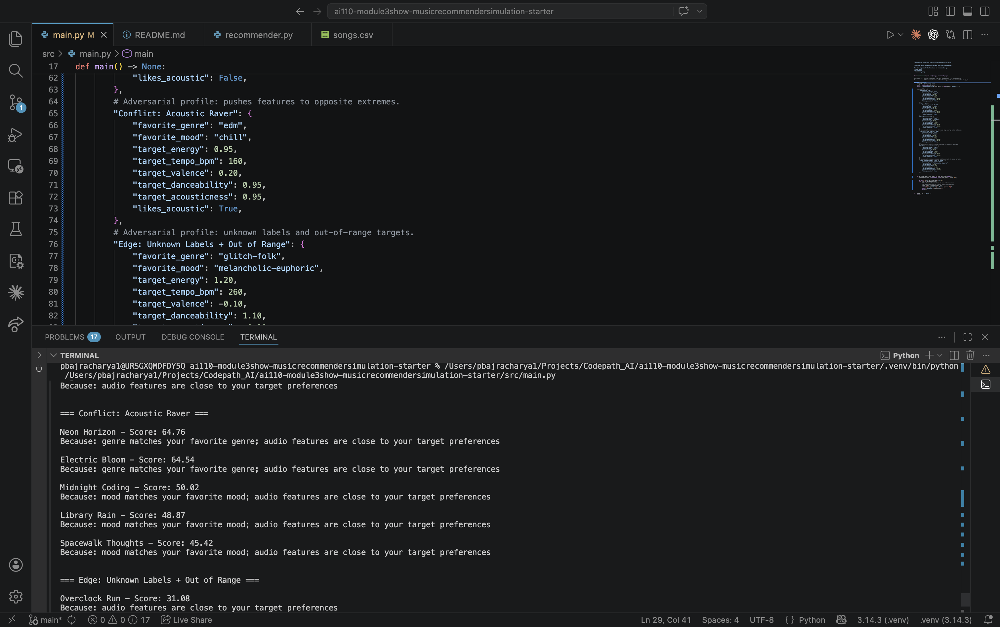
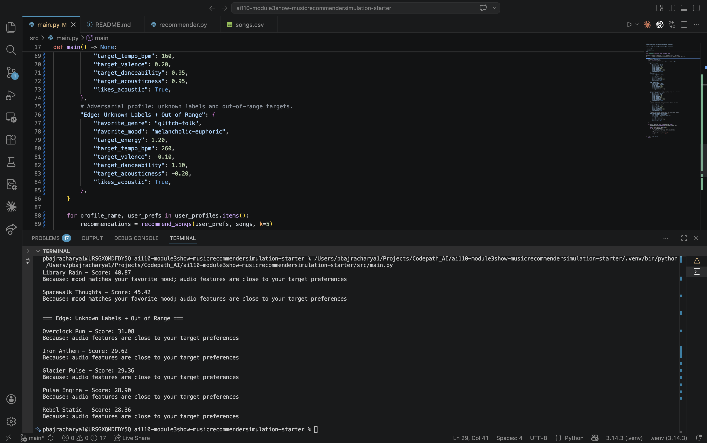
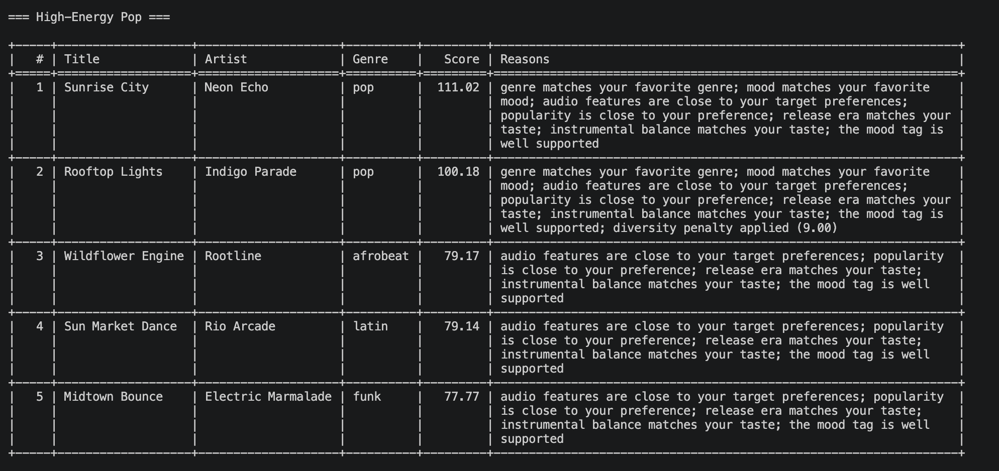
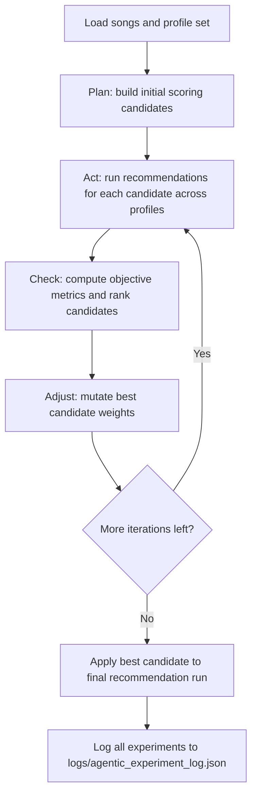

# 🎵 Music Recommender Simulation

## Project Summary

In this project you will build and explain a small music recommender system.

Your goal is to:

- Represent songs and a user "taste profile" as data
- Design a scoring rule that turns that data into recommendations
- Evaluate what your system gets right and wrong
- Reflect on how this mirrors real world AI recommenders

Replace this paragraph with your own summary of what your version does.

---

## How The System Works

Explain your design in plain language.

Some prompts to answer:

- What features does each `Song` use in your system
  - For example: genre, mood, energy, tempo
- What information does your `UserProfile` store
- How does your `Recommender` compute a score for each song
- How do you choose which songs to recommend

You can include a simple diagram or bullet list if helpful.

My recommender is a simple content based system. It compares each song's attributes to a user's taste profile, gives the song a score, then ranks songs from highest score to lowest score.

Song features used

- Genre (example: pop, lofi, jazz)
- Mood (example: happy, chill, focused, intense)
- Energy (0 to 1)
- Tempo in BPM
- Valence (how positive or negative the sound feels)
- Danceability
- Acousticness
- Artist (small bonus signal only)

### What the UserProfile stores

- Favorite genre
- Favorite mood
- Target energy level
- Whether the user prefers acoustic sounding songs

### Example taste profile

```python
taste_profile = {
  "favorite_genre": "lofi",
  "favorite_mood": "chill",
  "target_energy": 0.45,
  "target_tempo_bpm": 80,
  "target_valence": 0.60,
  "target_danceability": 0.60,
  "target_acousticness": 0.75,
  "likes_acoustic": True,
}
```

### How scoring works

For each candidate song, the model adds up points based on how well the song matches the user's taste profile.

- +30 points if the song genre matches the user's favorite genre
- +20 points if the song mood matches the user's favorite mood
- Up to +12 points for energy similarity
- Up to +12 points for valence similarity
- Up to +10 points for danceability similarity
- Up to +10 points for tempo similarity
- Up to +6 points for acousticness similarity
- Optional small artist bonus if the user already listens to that artist

The similarity features use closeness, so songs that are near the user's target energy, tempo, valence, danceability, and acousticness get more points than songs that are far away.

One good rule of thumb is that genre should matter a little more than mood, and mood should matter more than any single numeric feature. That keeps the system from being too narrow while still separating songs like intense rock and chill lofi.

### Final scoring idea:

Score(user, song) = genre points + mood points + similarity points + small artist bonus

Algorithm Recipe

1. Start with a score of 0 for every song in the CSV.
2. Add 30 points if the song's genre matches the user's favorite genre.
3. Add 20 points if the song's mood matches the user's favorite mood.
4. Add similarity points for numeric features by checking how close the song is to the user's target values.
5. Give a small bonus if the user already listens to that artist.
6. Score every song, sort from highest to lowest, and return the top k songs.

### Potential Biases

This system might over-prioritize genre and exact mood matches, which can cause it to miss great songs that fit the user's energy or acoustic preferences better. It can also favor the most obvious songs in one style and under-recommend songs that are close in sound but use a different genre label.

### How recommendations are chosen

1. Compute the score for every song in the catalog.
2. Sort songs by score in descending order.
3. Return the top k songs (for example, top 5).
4. Optionally re-rank to reduce near-duplicate songs and improve diversity.

### Simple pipeline

UserProfile + Song features -> Score each song -> Rank all songs -> Return top recommendations

### Data flow map



This flow shows how a single song moves from the CSV file into the scoring loop, gets a score, and then competes with the other songs in the ranked list. The recommender repeats that same process for every row in the CSV before returning the top K results.










### Improved version with more features and better scoring logic. 
The system now considers more song attributes and has a more balanced scoring approach that does not over-prioritize genre or mood. It also includes a small artist bonus to reward users for listening to the same artists.




---

## Extended Version (Applied AI)

Add a reliability/testing layer with a few profile-based evaluation cases.
Add an agentic workflow for automatic experiment runs and weight tuning.

### Agentic Workflow Pipeline



### Run Commands

Standard run:

```bash
python -m src.main
```

Agentic run with tuning and logging:

```bash
python -m src.main --agentic-tune --tune-iterations 3 --top-k 5
```

Optional custom log path:

```bash
python -m src.main --agentic-tune --tune-iterations 4 --tune-log-path logs/custom_agentic_log.json
```