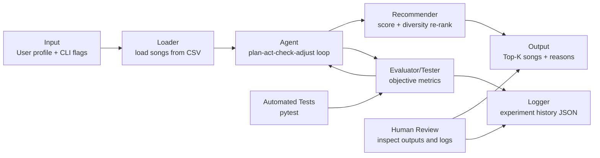

# BeatBuddy 2.0

## Title and Summary

BeatBuddy 2.0 is a music recommendation app that ranks songs based on how well each track matches a user taste profile. The system started as a rule-based recommender and was extended with an agentic workflow that automatically runs experiments, evaluates performance, and tunes scoring weights. This matters because it demonstrates a practical Applied AI pattern: combine transparent scoring logic with iterative, testable improvement loops.

## Original Project (Modules 1-3)

**Original project name:** Music Recommender Simulation (Modules 1-3).

**Base project identifier for this extension:** Module 1-3 Music Recommender Simulation (content-based recommender baseline).

The original version focused on content-based recommendation using explicit user preferences such as genre, mood, and energy. It could load songs from CSV, compute a score per song, and return top-k recommendations with text explanations. The extension in this repo keeps that core capability and adds automatic experiment runs plus logging-driven tuning.

## Design and Architecture: How the System Fits Together



### Architecture Overview

The system has two connected layers. The recommendation layer scores songs and produces ranked outputs. The agentic layer runs multiple scoring candidates, evaluates each one on profile-based metrics, and updates weights across iterations.

Data flow is: input profile and song catalog -> scoring and ranking -> recommendation output. During agentic runs, the evaluator feeds metrics back into the tuner loop before final output. Human review and automated tests both act as quality checkpoints.

## Main Components

- **Loader**: Reads `data/songs.csv` and normalizes values.
- **Recommender**: Computes score from genre/mood matches and numeric feature similarity.
- **Agentic Tuner**: Tries candidate scoring modes and weight overrides, then mutates the best candidate.
- **Evaluator/Tester**: Tracks genre hit rate, mood hit rate, explanation coverage, and objective score.
- **Experiment Logger**: Writes iteration-level logs to `logs/agentic_experiment_log.json`.
- **Human-in-the-loop Check**: Reviews recommendations and logs for plausibility and bias.

## Setup Instructions

1. Clone the repository and move into the project folder.
2. Create a virtual environment:

```bash
python -m venv .venv
source .venv/bin/activate
```

3. Install dependencies:

```bash
pip install -r requirements.txt
```

4. Run the standard recommender:

```bash
python -m src.main
```

5. Run with agentic tuning and logging:

```bash
python -m src.main --agentic-tune --tune-iterations 3 --top-k 5
```

6. Launch the interactive Streamlit demo (baseline vs agentic comparison):

```bash
streamlit run src/streamlit_app.py
```

The Streamlit demo now includes two tabs:

- **Recommendations: What/How/Why**: side-by-side baseline vs agentic results with explanation text.
- **Analytics: Confidence and Rank Shift**: confidence distribution charts and rank-shift charts/table to show what changed after tuning.

7. Run tests:

```bash
python -m pytest -q
```

8. Run the evaluation harness (predefined profiles + pass/fail summary):

```bash
python -m src.evaluate
```

9. Run evaluation harness with agentic tuning enabled:

```bash
python -m src.evaluate --agentic --tune-iterations 3
```

## Interactive Demo Highlights (Streamlit)

The app is designed for live demos and includes:

- Preset input profiles (at least 3) plus editable controls for genre, mood, and numeric targets.
- Baseline vs agentic tuned recommendations shown side-by-side.
- Confidence score per recommendation.
- "What changed" summary showing songs added/removed after tuning.
- Analytics tab with confidence distribution and rank-shift visualizations.

## Test Harness / Evaluation Script

The project includes a dedicated evaluation harness in `src/evaluate.py`.

- Runs multiple predefined profiles automatically.
- Computes reliability metrics: `genre_hit_rate`, `mood_hit_rate`, `avg_confidence`, and `objective_score`.
- Prints threshold checks and a clear `OVERALL: PASS/FAIL` result.
- Supports both baseline and agentic modes.

Example runs:

```bash
python -m src.evaluate
python -m src.evaluate --agentic --tune-iterations 3
```

Example summary (baseline run):

```text
genre_hit_rate: 0.8333
mood_hit_rate: 0.6667
avg_confidence: 0.7981
objective_score: 0.7614
OVERALL: PASS
```

## Sample Interactions

### Example 1: High-Energy Pop profile

**Input:**

```text
favorite_genre=pop, favorite_mood=happy, target_energy=0.90
```

**Output excerpt:**

```text
1) Sunrise City (pop) - score 124.50
2) Rooftop Lights (pop) - score 113.86
3) Gym Hero (pop) - score 83.08
```

### Example 2: Chill Lofi profile

**Input:**

```text
favorite_genre=lofi, favorite_mood=chill, target_energy=0.30
```

**Output excerpt:**

```text
1) Library Rain (lofi) - score 124.06
2) Focus Flow (lofi) - score 114.12
3) Spacewalk Thoughts (ambient) - score 92.79
```

### Example 3: Agentic run summary

**Command:**

```bash
python -m src.main --agentic-tune --tune-iterations 3 --top-k 5
```

**Output excerpt:**

```text
Agentic Tuning Summary
Iterations logged: 12
Best scoring mode: genre-first
Best weight overrides: {'mood': 23.0}
```

## Design Decisions and Trade-offs

1. **Rule-based scoring over black-box modeling**
   - Decision: use explicit scoring terms (genre, mood, tempo, valence, etc.).
   - Benefit: transparent, debuggable, and easy to explain.
   - Trade-off: less expressive than a fully learned recommender.

2. **Agentic tuning over manual retuning**
   - Decision: add plan-act-check-adjust loop for automatic experiments.
   - Benefit: faster iteration and reproducible tuning with logs.
   - Trade-off: objective quality depends on chosen metrics and candidate search space.

3. **Diversity re-ranking**
   - Decision: penalize repeated artist/genre in top results.
   - Benefit: reduces repetitive recommendations.
   - Trade-off: can lower pure match score for stronger diversity.

## Reliability and Evaluation: How I Test and Improve the AI

This project includes multiple reliability checks so performance is measured, not assumed.

- **Automated tests**: `python -m pytest -q` currently reports **4 out of 4 tests passed**.
- **Metric-based evaluation**: each agentic candidate run computes `genre_hit_rate`, `mood_hit_rate`, `explanation_rate`, and `objective_score` across 6 profiles.
- **Confidence-like signal**: the `objective_score` (0 to 1) is used as a confidence proxy when comparing candidate scoring configurations.
- **Logging and error handling**: every tuning step is stored in `logs/agentic_experiment_log.json`; log loading is fail-safe and defaults to an empty history if JSON is missing/corrupt.
- **Human evaluation**: recommendation outputs are manually inspected for plausibility, diversity, and explanation quality.

### Guardrails currently implemented

- Weight overrides are constrained to known keys and non-negative numeric values.
- Optional explicit-content penalty can reduce ranking score for explicit songs.
- Agentic experiment logs are fault-tolerant to missing/corrupt JSON.
- Evaluation harness enforces threshold checks and reports pass/fail.

### Quantitative Summary

- **4/4 tests passed** after integrating the agentic workflow.
- In a recent tuning run (12 logged evaluations), top configuration reached **genre hit rate = 0.8333**, **mood hit rate = 0.6667**, **explanation coverage = 1.0**, and **objective score = 0.7899**.
- Main failure mode observed during development: import/runtime setup issues (packaging path and missing dependency), resolved with import cleanup and environment setup.

## Testing Summary

### What worked

- Core recommendation behavior passed unit tests.
- Agentic workflow ran end-to-end and produced experiment logs.
- Weight override behavior changed scores as expected.

### What did not work initially

- Packaging/import mismatch caused `python -m src.main` to fail before import cleanup.
- Local runtime failed when dependencies were missing until environment setup was completed.

### What I learned

- Reliability improves when imports support both package and script execution paths.
- Agent loops are most useful when metrics are explicit and logged every iteration.
- Adding tests for both output quality and pipeline behavior prevents silent regressions.

## Reflection and Ethics

### What are the limitations or biases in this system?

This recommender is still a rules-and-weights system, so it reflects the assumptions built into those weights. Genre and mood labels can be noisy or culturally biased, and strong genre matching can over-recommend mainstream categories while under-representing niche styles. The dataset is small and curated, so performance may not generalize to real user behavior, multilingual catalogs, or rapidly changing tastes.

### Could this AI be misused, and how would I prevent that?

A recommender can be misused to push narrow content loops, prioritize commercial goals over user well-being, or quietly suppress certain artists. To reduce misuse, I would keep ranking criteria transparent, retain diversity penalties, and add policy checks for harmful optimization objectives. I would also require logging and human review for configuration changes so that aggressive tuning decisions are auditable before deployment.

### What surprised me while testing reliability?

I expected model-like tuning to be the hardest part, but reliability issues were initially caused by software plumbing: import-path and environment dependency errors. After those were fixed, the system became stable quickly, and metric logging made the tuning loop much easier to reason about. Another surprise was that explanation coverage stayed consistently high even when mood hit rate was lower, which showed that readable output does not always mean better recommendation quality.

### Collaboration with AI during this project

I used AI as a coding copilot for implementation speed and review support, not as an unquestioned authority.

- Helpful suggestion: the AI proposed adding an experiment log for each tuning iteration (candidate config plus metrics). That made the agentic workflow reproducible and significantly improved debugging and comparison across runs.
- Flawed suggestion: one AI-generated import change introduced an extra absolute import that broke module execution (`python -m src.main`). I caught this through runtime testing and corrected the import structure so both package and script paths work correctly.