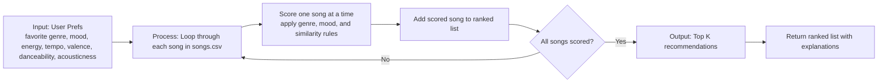

# 🎵 Music Recommender Simulation

## Project Summary

In this project you will build and explain a small music recommender system.

Your goal is to:

- Represent songs and a user "taste profile" as data
- Design a scoring rule that turns that data into recommendations
- Evaluate what your system gets right and wrong
- Reflect on how this mirrors real world AI recommenders

Replace this paragraph with your own summary of what your version does.

---

## How The System Works

Explain your design in plain language.

Some prompts to answer:

- What features does each `Song` use in your system
  - For example: genre, mood, energy, tempo
- What information does your `UserProfile` store
- How does your `Recommender` compute a score for each song
- How do you choose which songs to recommend

You can include a simple diagram or bullet list if helpful.

My recommender is a simple content based system. It compares each song's attributes to a user's taste profile, gives the song a score, then ranks songs from highest score to lowest score.

Song features used

- Genre (example: pop, lofi, jazz)
- Mood (example: happy, chill, focused, intense)
- Energy (0 to 1)
- Tempo in BPM
- Valence (how positive or negative the sound feels)
- Danceability
- Acousticness
- Artist (small bonus signal only)

What the UserProfile stores

- Favorite genre
- Favorite mood
- Target energy level
- Whether the user prefers acoustic sounding songs

Example taste profile

```python
taste_profile = {
  "favorite_genre": "lofi",
  "favorite_mood": "chill",
  "target_energy": 0.45,
  "target_tempo_bpm": 80,
  "target_valence": 0.60,
  "target_danceability": 0.60,
  "target_acousticness": 0.75,
  "likes_acoustic": True,
}
```

How scoring works

For each candidate song, the model adds up points based on how well the song matches the user's taste profile.

- +30 points if the song genre matches the user's favorite genre
- +20 points if the song mood matches the user's favorite mood
- Up to +12 points for energy similarity
- Up to +12 points for valence similarity
- Up to +10 points for danceability similarity
- Up to +10 points for tempo similarity
- Up to +6 points for acousticness similarity
- Optional small artist bonus if the user already listens to that artist

The similarity features use closeness, so songs that are near the user's target energy, tempo, valence, danceability, and acousticness get more points than songs that are far away.

One good rule of thumb is that genre should matter a little more than mood, and mood should matter more than any single numeric feature. That keeps the system from being too narrow while still separating songs like intense rock and chill lofi.

Final scoring idea:

Score(user, song) = genre points + mood points + similarity points + small artist bonus

Algorithm Recipe

1. Start with a score of 0 for every song in the CSV.
2. Add 30 points if the song's genre matches the user's favorite genre.
3. Add 20 points if the song's mood matches the user's favorite mood.
4. Add similarity points for numeric features by checking how close the song is to the user's target values.
5. Give a small bonus if the user already listens to that artist.
6. Score every song, sort from highest to lowest, and return the top k songs.

Potential Biases

This system might over-prioritize genre and exact mood matches, which can cause it to miss great songs that fit the user's energy or acoustic preferences better. It can also favor the most obvious songs in one style and under-recommend songs that are close in sound but use a different genre label.

How recommendations are chosen

1. Compute the score for every song in the catalog.
2. Sort songs by score in descending order.
3. Return the top k songs (for example, top 5).
4. Optionally re-rank to reduce near-duplicate songs and improve diversity.

Simple pipeline

UserProfile + Song features -> Score each song -> Rank all songs -> Return top recommendations

Data flow map



This flow shows how a single song moves from the CSV file into the scoring loop, gets a score, and then competes with the other songs in the ranked list. The recommender repeats that same process for every row in the CSV before returning the top K results.


---

## Getting Started

### Setup

1. Create a virtual environment (optional but recommended):

   ```bash
   python -m venv .venv
   source .venv/bin/activate      # Mac or Linux
   .venv\Scripts\activate         # Windows

2. Install dependencies

```bash
pip install -r requirements.txt
```

3. Run the app:

```bash
python -m src.main
```

### Running Tests

Run the starter tests with:

```bash
pytest
```

You can add more tests in `tests/test_recommender.py`.

---

## Experiments You Tried

Use this section to document the experiments you ran. For example:

- What happened when you changed the weight on genre from 2.0 to 0.5
- What happened when you added tempo or valence to the score
- How did your system behave for different types of users

---

## Limitations and Risks

Summarize some limitations of your recommender.

Examples:

- It only works on a tiny catalog
- It does not understand lyrics or language
- It might over favor one genre or mood

You will go deeper on this in your model card.

---

## Reflection

Read and complete `model_card.md`:

[**Model Card**](model_card.md)

Write 1 to 2 paragraphs here about what you learned:

- about how recommenders turn data into predictions
- about where bias or unfairness could show up in systems like this


---

## 7. `model_card_template.md`

Combines reflection and model card framing from the Module 3 guidance. :contentReference[oaicite:2]{index=2}  

```markdown
# 🎧 Model Card - Music Recommender Simulation

## 1. Model Name

Give your recommender a name, for example:

> VibeFinder 1.0

---

## 2. Intended Use

- What is this system trying to do
- Who is it for

Example:

> This model suggests 3 to 5 songs from a small catalog based on a user's preferred genre, mood, and energy level. It is for classroom exploration only, not for real users.

---

## 3. How It Works (Short Explanation)

Describe your scoring logic in plain language.

- What features of each song does it consider
- What information about the user does it use
- How does it turn those into a number

Try to avoid code in this section, treat it like an explanation to a non programmer.

---

## 4. Data

Describe your dataset.

- How many songs are in `data/songs.csv`
- Did you add or remove any songs
- What kinds of genres or moods are represented
- Whose taste does this data mostly reflect

---

## 5. Strengths

Where does your recommender work well

You can think about:
- Situations where the top results "felt right"
- Particular user profiles it served well
- Simplicity or transparency benefits

---

## 6. Limitations and Bias

Where does your recommender struggle

Some prompts:
- Does it ignore some genres or moods
- Does it treat all users as if they have the same taste shape
- Is it biased toward high energy or one genre by default
- How could this be unfair if used in a real product

---

## 7. Evaluation

How did you check your system

Examples:
- You tried multiple user profiles and wrote down whether the results matched your expectations
- You compared your simulation to what a real app like Spotify or YouTube tends to recommend
- You wrote tests for your scoring logic

You do not need a numeric metric, but if you used one, explain what it measures.

---

## 8. Future Work

If you had more time, how would you improve this recommender

Examples:

- Add support for multiple users and "group vibe" recommendations
- Balance diversity of songs instead of always picking the closest match
- Use more features, like tempo ranges or lyric themes

---

## 9. Personal Reflection

A few sentences about what you learned:

- What surprised you about how your system behaved
- How did building this change how you think about real music recommenders
- Where do you think human judgment still matters, even if the model seems "smart"

