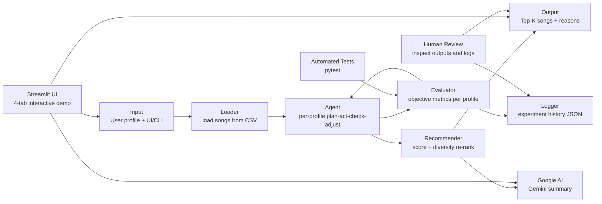

# BeatBuddy 2.0: Music Recommender with Agentic Tuning

## Title and Summary

**BeatBuddy 2.0** is a music recommendation system that ranks songs based on how well each track matches a user taste profile. The system started as a rule-based recommender and was extended with an agentic workflow that automatically runs experiments, evaluates performance, and tunes scoring weights — separately per user profile. A Streamlit interactive demo lets you compare three approaches side by side: the fixed rule-based scorer, the same scorer augmented with a Google Gemini natural-language summary, and the agentic tuning loop that finds the best configuration for each specific profile. This matters because it demonstrates a practical Applied AI pattern: combine transparent scoring logic with iterative, testable improvement loops and LLM-based output augmentation.

## Original Project (Modules 1-3)

**Original project name:** Music Recommender Simulation (Modules 1-3).

The original version focused on content-based recommendation using explicit user preferences such as genre, mood, and energy. It could load songs from CSV, compute a score per song, and return top-k recommendations with text explanations. The extension in this repo keeps that core capability and adds automatic experiment runs, per-profile logging-driven tuning, and an interactive Streamlit UI with a Google AI summary layer.

## Design and Architecture: How the System Fits Together



### Architecture Overview

The system has three connected layers. The recommendation layer scores songs and produces ranked outputs with feature-level explanations. The agentic layer runs multiple scoring candidates independently per user profile, evaluates each on profile-based metrics, and updates weights across iterations — ensuring each profile converges to its own best configuration rather than a one-size-fits-all global result. The presentation layer (Streamlit UI) surfaces all of this interactively: four tabs let you inspect what was recommended, how the rule-based scorer works, how each agentic iteration changed the output compared to the baseline, and analytics on confidence distribution and rank shifts across the full catalog.

Data flow: input profile and song catalog → scoring and ranking → recommendation output. During agentic runs, the evaluator feeds metrics back into the tuner loop before final output. The Google AI layer receives the structured ranked output and generates a conversational summary. Human review and automated tests both act as quality checkpoints.

## Main Components

- **Loader** (`src/recommender.py`): Reads `data/songs.csv` and normalizes values.
- **Recommender** (`src/recommender.py`): Computes score from genre/mood matches and numeric feature similarity across 12 weighted features. Supports `balanced`, `genre-first`, `mood-first`, and `energy-focused` scoring modes, plus arbitrary weight overrides per run.
- **Agentic Tuner** (`src/agentic_workflow.py`): Runs a per-profile plan-act-evaluate-adjust loop. Each iteration tests a pool of candidate configurations, ranks them by objective score, keeps the top 3, and generates a mutated candidate that both addresses underperforming metrics and always explores a new feature combination in round-robin order — preventing iterations from stalling on the same configuration.
- **Evaluator** (`src/evaluate.py`): Tracks genre hit rate, mood hit rate, explanation coverage, and composite objective score across 6 representative profiles (standard + conflict + edge cases).
- **Experiment Logger** (`src/agentic_workflow.py`): Writes iteration-level logs to `logs/agentic_experiment_log.json`, tagged with `profile_name` for per-profile traceability.
- **Google AI Integration** (`src/google_ai.py`): Calls the Google Gemini API to convert structured ranked recommendations into a conversational summary. Falls back gracefully to the top recommendation plus explanation if the API is unavailable.
- **Streamlit UI** (`src/streamlit_app.py`): Four-tab interactive demo with sidebar profile selector, output mode toggle (`rule` / `ai` / `agentic` / `agentic-ai`), and controls for top-K and tuning iterations. Tabs: Recommendations (baseline vs active side-by-side), Rule-Based Baseline (weight table + scoring formula), Agentic Iterations (per-iteration diffs vs baseline), and Analytics (confidence distribution + rank shift).
- **Human-in-the-loop Check**: Reviews recommendations and logs for plausibility, diversity, and potential bias.

## Setup Instructions

1. Clone the repository and move into the project folder.
2. Create a virtual environment:

```bash
python -m venv .venv
source .venv/bin/activate
```

3. Install dependencies:

```bash
pip install -r requirements.txt
```

4. (Optional) Set the Google API key to enable Gemini summaries. Create a `.env` file in the project root or export the variable:

```bash
export GOOGLE_API_KEY=your_key_here
```

5. Launch the Streamlit demo:

```bash
streamlit run src/streamlit_app.py
```

6. Run the standard recommender from the CLI:

```bash
python -m src.main
```

7. Run with agentic tuning and logging:

```bash
python -m src.main --agentic-tune --tune-iterations 3 --top-k 5
```

8. Run tests:

```bash
python -m pytest -q
```

## Sample Interactions

### Example 1: High-Energy Pop profile

**Input:**

```text
favorite_genre=pop, favorite_mood=happy, target_energy=0.90
```

**Output excerpt:**

```text
1) Sunrise City (pop) - score 124.50
2) Rooftop Lights (pop) - score 113.86
3) Gym Hero (pop) - score 83.08
```

### Example 2: Chill Lofi profile

**Input:**

```text
favorite_genre=lofi, favorite_mood=chill, target_energy=0.30
```

**Output excerpt:**

```text
1) Library Rain (lofi) - score 124.06
2) Focus Flow (lofi) - score 114.12
3) Spacewalk Thoughts (ambient) - score 92.79
```

### Example 3: Per-profile agentic tuning run

**Command:**

```bash
python -m src.main --agentic-tune --tune-iterations 3 --top-k 5
```

**Output excerpt:**

```text
Agentic Tuning Summary
Iterations logged: 12
Best scoring mode (High-Energy Pop): genre-first
Best weight overrides (High-Energy Pop): {'mood': 23.0, 'energy': 26.0}
Best scoring mode (Chill Lofi): balanced
Best weight overrides (Chill Lofi): {'valence': 16.0}
```

Each profile receives its own tuned candidate. The tuner runs independently per profile so a chill lofi listener and a high-energy pop listener converge on different configurations.

### Example 4: Streamlit output modes

In the Streamlit UI, selecting different output modes from the sidebar changes what the active output column shows:

| Mode | What it does |
|------|--------------|
| `rule` | Fixed balanced weights, no tuning |
| `ai` | Same fixed weights + Google Gemini conversational summary |
| `agentic` | Per-profile tuned weights applied, no summary |
| `agentic-ai` | Per-profile tuned weights + Google Gemini summary |

The **Agentic Iterations** tab (visible in `agentic` and `agentic-ai` modes) shows — for each iteration — which scoring mode was selected, which feature weights changed versus the baseline, which songs were added to or dropped from the top-K, and a side-by-side comparison of baseline vs that iteration's recommendations.

## Design Decisions and Trade-offs

1. **Rule-based scoring over black-box modeling**
   - Decision: use explicit scoring terms (genre, mood, tempo, valence, etc.) with fixed weights.
   - Benefit: transparent, debuggable, and easy to explain — every score traces back to a feature comparison.
   - Trade-off: less expressive than a fully learned recommender; cannot capture latent taste patterns.

2. **Per-profile agentic tuning over global tuning**
   - Decision: run the plan-act-evaluate-adjust loop independently for each user profile rather than optimizing a single global candidate across all profiles.
   - Benefit: each profile converges to its own best scoring mode and weight configuration, producing genuinely personalized results rather than a one-size-fits-all solution.
   - Trade-off: compute time scales with number of profiles; N profiles means N independent tuning loops.

3. **Round-robin feature exploration in mutation step**
   - Decision: the adjusted candidate always modifies at least one feature weight in round-robin order (energy → valence → danceability → acousticness → tempo → popularity) in addition to any metric-driven adjustments.
   - Benefit: prevents iterations from stalling when all metrics already exceed their thresholds — the agent keeps exploring rather than repeating the same pool of candidates.
   - Trade-off: introduces exploratory noise even when the current configuration is already good; the objective function must be reliable to distinguish genuine improvements from random variation.

4. **Diversity re-ranking**
   - Decision: penalize repeated artist/genre in top results.
   - Benefit: reduces repetitive recommendations.
   - Trade-off: can lower pure match score for stronger diversity.

5. **Google AI as a presentation layer, not a ranking layer**
   - Decision: Gemini is called only after ranking is complete; it receives structured output (songs, scores, explanations) and converts it to natural language.
   - Benefit: the ranking stays fully deterministic and auditable; the LLM cannot alter the recommendation logic or introduce hallucinated rankings.
   - Trade-off: the natural-language summary quality depends on Gemini availability; fallback returns the top recommendation plus its rule-based explanation.

## Reliability and Evaluation: How I Test and Improve the AI

This project includes multiple reliability checks so performance is measured, not assumed.

- **Automated tests**: `python -m pytest -q` currently reports **4 out of 4 tests passed**.
- **Metric-based evaluation**: each agentic candidate run computes `genre_hit_rate`, `mood_hit_rate`, `explanation_rate`, and `objective_score` — separately per profile for per-profile tuning runs.
- **Objective score formula**: `(0.45 × genre_hit_rate) + (0.40 × mood_hit_rate) + (0.10 × explanation_rate) + (0.05 × normalized_avg_top_score)`. This prioritizes explicit user-intent matches (genre, mood) over raw numeric scores.
- **Confidence-like signal**: the `objective_score` (0 to 1) is used as a confidence proxy when comparing candidate scoring configurations across iterations.
- **Logging and error handling**: every tuning step is stored in `logs/agentic_experiment_log.json` with a `profile_name` tag for per-profile traceability; log loading is fail-safe and defaults to an empty history if JSON is missing or corrupt.
- **Iteration integrity**: the `seen_signatures` deduplication set prevents the same candidate configuration from being evaluated twice, while the round-robin exploration step guarantees each iteration adds at least one genuinely new configuration to test.
- **Human evaluation**: recommendation outputs are manually inspected for plausibility, diversity, and explanation quality. The Streamlit UI's per-iteration diff view makes this inspection structural — you can see exactly which songs were added or removed at each step.

### Quantitative Summary

- **4/4 tests passed** after integrating the agentic workflow.
- In a representative per-profile tuning run (3 iterations, 6 profiles), the `genre-first` scoring mode consistently produced the highest objective scores (~0.79) on standard profiles, while conflict and edge-case profiles converged to different modes.
- Explanation coverage (`explanation_rate`) remained at **1.0** across all runs — every recommendation includes a feature-level reason.
- Main failure mode identified and fixed during development: when all profile metrics exceeded their adjustment thresholds in iteration 1, the mutation step produced a no-op candidate whose signature matched an already-seen configuration, causing all subsequent iterations to repeat the same pool. Fixed by adding guaranteed round-robin feature exploration independent of metric thresholds.

## Testing Summary

### What worked

- Core recommendation behavior passed unit tests.
- Agentic workflow ran end-to-end and produced experiment logs.
- Weight override behavior changed scores as expected.
- Per-profile tuning produced different best candidates for different profile types.
- The Streamlit UI correctly surfaces per-iteration diffs and side-by-side comparisons.

### What did not work initially

- Packaging/import mismatch caused `python -m src.main` to fail before import cleanup.
- Local runtime failed when dependencies were missing until environment setup was completed.
- Agentic iterations produced identical results across all rounds when profile metrics were already strong — the mutation step generated a no-op candidate that was filtered by the deduplication check, leaving the pool unchanged. Fixed by ensuring the adjusted candidate always explores a new feature weight regardless of current metric values.

### What I learned

- Reliability improves when imports support both package and script execution paths.
- Agent loops are most useful when metrics are explicit and logged every iteration.
- Adding tests for both output quality and pipeline behavior prevents silent regressions.
- The mutation step in an agentic loop must guarantee novelty — not just react to failures — otherwise well-performing early iterations cause the loop to stall rather than continue exploring.

## Reflection and Ethics

### What are the limitations or biases in this system?

This recommender is still a rules-and-weights system, so it reflects the assumptions built into those weights. Genre and mood labels can be noisy or culturally biased, and strong genre matching can over-recommend mainstream categories while under-representing niche styles. The dataset is small (50 songs) and curated, so performance may not generalize to real user behavior, multilingual catalogs, or rapidly changing tastes. The Google AI summary layer inherits any biases present in the Gemini model — it can generate confident-sounding text even when the underlying recommendations are weak.

### Could this AI be misused, and how would I prevent that?

A recommender can be misused to push narrow content loops, prioritize commercial goals over user well-being, or quietly suppress certain artists. The agentic tuner specifically could be misused if the objective function were replaced with an engagement-maximizing metric that conflicts with user wellbeing. To reduce misuse, I would keep ranking criteria transparent, retain diversity penalties, and add policy checks for harmful optimization objectives. I would also require logging and human review for configuration changes so that aggressive tuning decisions are auditable before deployment. The experiment log with `profile_name` tagging already supports this kind of audit trail.

### What surprised me while testing reliability?

I expected model-like tuning to be the hardest part, but reliability issues were initially caused by software plumbing: import-path and environment dependency errors. After those were fixed, the system became stable quickly, and metric logging made the tuning loop much easier to reason about. A second surprise was that the agentic iteration loop silently stalled when metrics were already good — the agent appeared to be running but was testing the same three candidates each time. This was only visible by comparing iteration logs closely. It reinforced that the iteration mechanism itself needs to be tested, not just the output quality.

### Collaboration with AI during this project

I used AI as a coding copilot for implementation speed and review support, not as an unquestioned authority.

- Helpful suggestion: the AI proposed adding an experiment log for each tuning iteration (candidate config plus metrics). That made the agentic workflow reproducible and significantly improved debugging and comparison across runs.
- Helpful suggestion: the AI identified that the mutation step needed guaranteed novelty — adding the round-robin feature exploration ensured each iteration tests a genuinely new configuration even when all current metrics are already above threshold.
- Flawed suggestion: one AI-generated import change introduced an extra absolute import that broke module execution (`python -m src.main`). I caught this through runtime testing and corrected the import structure so both package and script paths work correctly.
